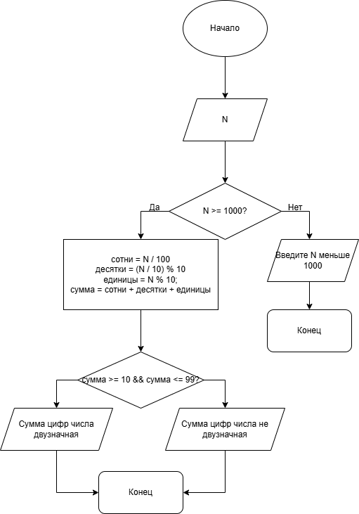

# Задание №3 в практической работе 6

## Условие задачи
Дано число N (N<1000). Написать программу, которая проверяет является ли его сумма цифр двухзначным числом.

## 1. Алгоритм и блок-схема

### Алгоритм
1. **Начало**
2. Задать переменные:
   - `N` - число, вводимое пользователем.
   - `сотни` - сотни введённого числа.
   - `десятки` - десятки введённого числа.
   - `единицы` - единицы введённого числа.
   - `сумма` - сумма цифр введённого числа.
4. Ввести данные:
   - `N` - число, сумму цифр которого будем считать.
5. Проверить меньше ли 1000 число N.
   - Да - переходим на следующий этап.
   - Нет - Выводим ошибку в консоль. 
6. Считаем сотни, десятки и единицы
   - сотни = `N` / 100
   - десятки = (`N` / 10) % 10
   - единицы = `N` % 10
7. Проверяем является ли сумма цифр числа N двузначной:
   - if (сумма >= 10 && сумма <= 99) printf("Сумма цифр числа %d двузначная", N);
   - else  printf("Сумма цифр числа %d не двузначная", N);
### Блок-схема
 

## 2. Реализация программы
```
#include <stdio.h>
#include <locale.h>
void main() 
{
    setlocale(LC_ALL, "RUS");
    int N, сотни, десятки, единицы, сумма;
    printf("Введите число N (N < 1000): ");
    scanf_s("%d", &N);
    if (N >= 1000) 
    {
        printf("Введите N меньше 1000");
    }
    сотни = N / 100;
    десятки = (N / 10) % 10;
    единицы = N % 10;
    сумма = сотни + десятки + единицы;
    if (сумма >= 10 && сумма <= 99) printf("Сумма цифр числа %d двузначная", N);
    else  printf("Сумма цифр числа %d не двузначная", N);
}
```
## 3. Результаты работы программы

Введите число N (N < 1000): 352
Сумма цифр числа 352 двузначная

## 4. Информация о разработчике

Калашников Дмитрий бИПТ-251
